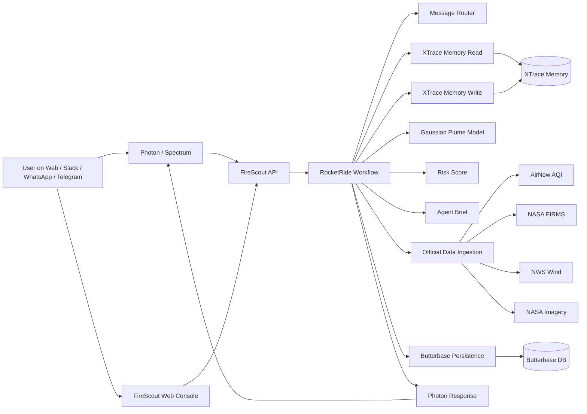
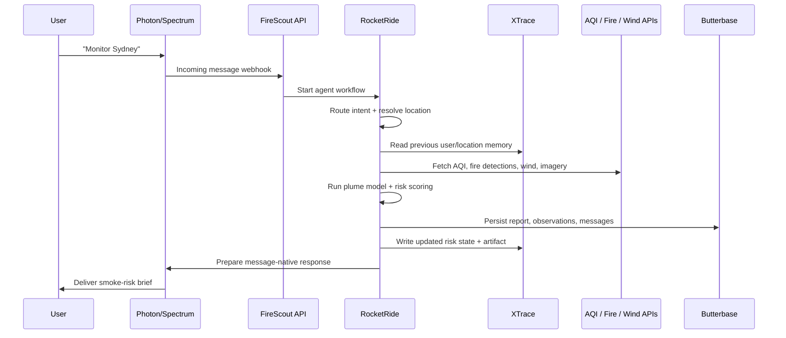

<div align="center">
  

# FireScout

**A global wildfire smoke intelligence agent** that monitors any location, runs RocketRide-powered AI workflows, remembers changing conditions with XTrace, persists reports through Butterbase, and delivers actionable smoke-risk updates through Photon/Spectrum messaging.


</div>

---

**Hackathon:** Agentic AI SF Hackathon  
**Theme:** Production-Ready Agentic AI Applications  
**Built with:** RocketRide · Butterbase · XTrace · Photon/Spectrum  
**Live demo:** [FireScout on Vercel](https://firescout-fqti629ti-volodymyrlinuxovichs-projects.vercel.app)  
**Team:** Volodymyr Borysenko

---

## The Problem

Wildfire smoke is global, fast-moving, and fragmented across AQI feeds, satellite fire detections, wind forecasts, weather data, maps, and emergency dashboards.

Most tools are passive dashboards: they show data, but they do not remember user context, compare conditions over time, or proactively deliver updates where users already are.

**FireScout is different. It is a messaging-native agent.**

Users can ask:

- “Monitor Sydney.”
- “What changed since yesterday?”
- “Alert me if smoke risk increases.”
- “Send me a daily smoke brief.”
- “Explain the risk in plain English.”

FireScout analyzes the location, remembers prior risk state, generates an explainable smoke-risk report, stores it, and prepares a messaging update.

---

## Built With

| Area | Stack |
|------|-------|
| **Frontend** | Next.js · React · TypeScript |
| **Deployment** | Vercel |
| **Agent orchestration** | RocketRide pipelines |
| **Backend** | Butterbase database, auth, storage, AI model gateway |
| **Memory** | XTrace persistent self-revising memory |
| **Messaging** | Photon/Spectrum webhook + messaging delivery |
| **Data sources** | AirNow AQI · NASA FIRMS fire detections · NWS wind forecasts · NASA satellite imagery |
| **Modeling** | Gaussian plume approximation · smoke-risk scoring |

---

## Architecture at a Glance



---

## End-to-End Agent Cycle



---

## The FireScout Agent

FireScout is not a single LLM call and not just a map.

It is an **agentic workflow** with perception, memory, persistence, reasoning, and delivery.

Every analysis cycle can:

1. Parse a user message or selected location.
2. Resolve a city, region, or coordinate globally.
3. Fetch AQI, fire detection, wind, and satellite signals.
4. Estimate likely smoke movement using a plume-style model.
5. Read previous memory from XTrace.
6. Compare current conditions against past reports.
7. Generate a plain-English risk brief.
8. Persist observations, reports, and messages through Butterbase.
9. Prepare delivery through Photon/Spectrum.
10. Write revised memory back into XTrace.

---

## RocketRide — Core Workflow Orchestration

RocketRide powers the main FireScout pipeline.

The product uses named workflows for the agent loop, including:

| Pipeline | Purpose |
|----------|---------|
| `message_router` | Detect user intent: risk brief, map, monitor, what changed, explain |
| `official_data_ingestion` | Pull AQI, fire detections, wind, and satellite context |
| `plume_model` | Estimate smoke direction and exposure proxy |
| `risk_brief` | Generate explainable wildfire-smoke report |
| `what_changed` | Compare current conditions with prior memory |
| `map_generation` | Prepare map artifacts and links |

Every user query routes through a named RocketRide-style pipeline instead of becoming a disconnected one-off response.

---

## Butterbase — Backend for the Agent

Butterbase provides the backend layer for FireScout.

FireScout uses Butterbase for:

- users
- monitored locations
- AQI observations
- fire detections
- wind snapshots
- plume model runs
- risk reports
- map artifacts
- messages
- AI model gateway access

This makes the agent production-oriented: reports and user context survive beyond a single browser session.

---

## XTrace — Persistent Memory

XTrace gives FireScout a durable memory layer.

The agent reads memory before responding and writes memory after each report.

FireScout can remember:

- user locations
- outdoor activity preferences
- prior smoke-risk levels
- previous AQI and fire context
- generated artifacts
- changed conditions
- group/team memory for shared monitoring

Example:

| User says | XTrace behavior |
|----------|------------------|
| “Monitor Berkeley and Sydney.” | Stores both monitored locations |
| “I care most about AQI.” | Saves AQI as a user preference |
| “What changed since yesterday?” | Compares current report to prior memory |
| “Explain it simply.” | Remembers preferred explanation style |

---

## Photon / Spectrum — Messaging Delivery

Photon/Spectrum brings FireScout to messaging platforms.

FireScout supports or prepares delivery through:

- Slack
- WhatsApp
- Telegram
- iMessage-style messaging flows

Example message:

```text
FireScout Daily Brief — Sydney

Risk Level: MODERATE
AQI: 71
Nearby fire detections: 4
Wind: 12 km/h NE

What changed:
AQI increased from 52 to 71 since your last report.
Smoke risk is slightly higher because wind direction shifted toward the city.

Recommendation:
Limit long outdoor activity if you are sensitive to smoke.
```

The goal is simple: users should not need to open a dashboard to get an operational smoke-risk brief.

---

## Data Sources

| Source | What it provides | Environment variable |
|--------|------------------|----------------------|
| AirNow | Real-time AQI / PM2.5 observations | `AIRNOW_API_KEY` |
| NASA FIRMS | MODIS / VIIRS fire detections | `NASA_FIRMS_MAP_KEY` |
| NWS | Wind speed and wind direction | none required, use User-Agent |
| NASA GIBS | Satellite imagery tiles | none required |
| Local incident feeds | Regional wildfire context when available | optional |

---

## Gaussian Plume Model

FireScout uses a simplified ground-level Gaussian plume approximation as an explainable smoke-exposure proxy:

```text
C(x, y) = Q / (2πuσyσz) · exp(-y² / 2σy²) · [exp(-(z-H)² / 2σz²) + exp(-(z+H)² / 2σz²)]
```

Wind convention:

- Meteorological wind direction describes where wind comes **from**.
- Smoke moves approximately toward `windDir + 180°`.
- The model uses a grid around the monitored location and normalizes plume exposure to a 0–100 score.

**This is an explainable estimate, not an official atmospheric forecast.**

---

## Risk Score

FireScout combines multiple signals into a final wildfire-smoke risk score:

```text
finalRisk = 0.45·AQIScore
          + 0.25·PlumeScore
          + 0.15·TrendScore
          + 0.10·FireProximityScore
          + 0.05·ActivityScore
```

Risk levels:

| Score | Level |
|-------|-------|
| 0–25 | Clear |
| 26–50 | Watch |
| 51–75 | Act |
| 76–100 | Critical |

---

## Dashboard

The FireScout dashboard includes:

- global location input
- smoke-risk brief
- AQI and PM2.5 metrics
- nearby fire detections
- wind direction and speed
- plume approximation
- interactive map
- RocketRide pipeline trace
- XTrace memory read/write panel
- Butterbase persistence status
- Photon message delivery panel
- “What changed since last report?” interaction

---

## What Makes This an Agent?

| Agent property | How FireScout implements it |
|---------------|-----------------------------|
| **Perceives** | Reads AQI, fire detections, wind, satellite imagery, and user messages |
| **Reasons** | Runs a multi-stage RocketRide workflow and smoke-risk model |
| **Remembers** | Uses XTrace to store persistent facts, preferences, and prior reports |
| **Persists** | Saves observations, reports, locations, and messages through Butterbase |
| **Acts** | Sends or prepares alerts through Photon/Spectrum |
| **Adapts** | Compares new conditions against memory and reports what changed |
| **Explains** | Produces concise, plain-English briefings |

---

## Project Structure

```text
firescout/
├── app/
│   ├── page.tsx
│   ├── api/
│   │   ├── analyze/
│   │   ├── photon/
│   │   ├── xtrace/
│   │   └── health/
├── components/
│   ├── AgentConsole.tsx
│   ├── RocketRidePipeline.tsx
│   ├── XTraceMemoryPanel.tsx
│   ├── PhotonDeliveryPanel.tsx
│   └── MapView.tsx
├── lib/
│   ├── plume.ts
│   ├── risk.ts
│   ├── integrations/
│   │   ├── rocketride.ts
│   │   ├── butterbase.ts
│   │   ├── xtrace.ts
│   │   ├── photon.ts
│   │   └── modelGateway.ts
│   └── data/
│       ├── airnow.ts
│       ├── nasaFirms.ts
│       └── nws.ts
├── pipelines/
│   ├── message_router.yaml
│   ├── official_data_ingestion.yaml
│   ├── plume_model.yaml
│   ├── risk_brief.yaml
│   ├── what_changed.yaml
│   └── map_generation.yaml
├── public/
├── .env.example
├── package.json
└── README.md
```

---

## Quick Start

```bash
git clone https://github.com/VolodymyrLinuxovich/firescout.git
cd firescout
npm install
cp .env.example .env.local
```

Set `USE_MOCK_DATA=true` for a fast local demo, or add real API keys.

```bash
npm run dev
```

Open:

```text
http://localhost:3000
```

---

## Environment Variables

Create `.env.local` in the project root.

```bash
# App
NEXT_PUBLIC_APP_URL=http://localhost:3000
USE_MOCK_DATA=true

# Environmental data
AIRNOW_API_KEY=your_airnow_key
NASA_FIRMS_MAP_KEY=your_nasa_firms_key

# Hackathon stack
ROCKETRIDE_API_KEY=your_rocketride_key
BUTTERBASE_API_KEY=your_butterbase_key
BUTTERBASE_PROJECT_ID=your_butterbase_project_id
XTRACE_API_KEY=your_xtrace_key
PHOTON_API_KEY=your_photon_key
PHOTON_CHANNEL=slack
```

Never commit real API keys to GitHub. Add production secrets through Vercel environment variables.

---

## Run Locally

```bash
npm run dev
```

---

## Tests / Demo Commands

```bash
npm run test:berkeley
npm run seed
```

`npm run seed` seeds demo data and memory for local testing.

---

## Deployment

```bash
vercel --prod
```

If you add or change environment variables, add them in Vercel first and then redeploy.

```bash
vercel env add XTRACE_API_KEY
vercel env add ROCKETRIDE_API_KEY
vercel env add BUTTERBASE_API_KEY
vercel env add PHOTON_API_KEY
vercel --prod
```

---

## Demo Script

1. Open FireScout.
2. Enter a global location, for example `Sydney`, `Los Angeles`, `Athens`, or `Kyiv`.
3. Ask FireScout to monitor the location.
4. Watch the RocketRide pipeline execute.
5. Show AQI, fire detections, wind, plume estimate, and risk score.
6. Open the XTrace memory panel.
7. Show the Butterbase persistence status.
8. Click the Photon message delivery action.
9. Ask: “What changed since last report?”
10. FireScout answers using previous memory.

---

## Hackathon Compliance

| Requirement | FireScout implementation |
|------------|--------------------------|
| **RocketRide** | Core multi-stage workflow for routing, ingestion, plume modeling, risk brief generation, memory, persistence, and delivery |
| **Butterbase** | Backend for users, monitored locations, observations, reports, artifacts, messages, and model gateway |
| **XTrace** | Persistent memory for preferences, prior reports, monitored locations, artifacts, and “what changed” reasoning |
| **Photon/Spectrum** | Messaging delivery layer through Slack / WhatsApp / Telegram-style flows |
| **Deep integration** | All four systems appear in the main agent loop, UI, and demo path |

---

## Safety Disclaimer

FireScout is decision support, not an emergency authority.

Air-quality and fire-detection data can be delayed, preliminary, incomplete, or unavailable for some regions. The plume model is a simplified proxy, not a certified atmospheric forecast.

For evacuation, emergency response, or official safety instructions, follow local officials, emergency alerts, weather services, and fire agencies.

---

## Known Limitations

- Mock mode uses simulated values and shows low-confidence outputs.
- The plume model is simplified and not a certified atmospheric model.
- Global data coverage depends on available providers and API access.
- Some messaging channels may require additional Photon/Spectrum configuration.
- Static map screenshots may be replaced with map links depending on deployment settings.

---

## Roadmap

- Full production Photon delivery across multiple messaging platforms
- Stronger global AQI provider coverage
- HRRR-Smoke or equivalent smoke forecast integration
- Historical exposure timeline
- Team/group memory for households, labs, and emergency teams
- XTrace artifact memory for generated reports and maps
- More advanced plume and transport modeling
- Scheduled daily smoke brief automation
- Mobile-first messaging experience

---

## Final Pitch

FireScout is not a dashboard.

It is a global wildfire smoke intelligence agent that monitors any location, remembers changing conditions, persists reports, and delivers actionable updates through messaging.

**Monitor anywhere. Remember everything. Alert instantly.**
